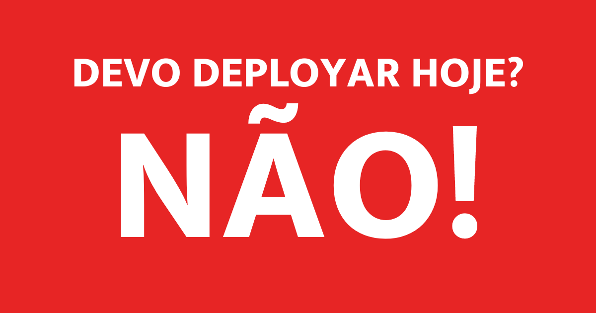

# Devo deployar hoje? <a href="https://devodeployar.dev"></a>

Um auxiliar para que você tome esta crucial decisão. Esse projeto é uma sátira e não deve ser levado a sério ─ ou talvez deva? 


## Tabela de conteúdos
- [Devo deployar hoje? ](#devo-deployar-hoje-)
  - [Tabela de conteúdos](#tabela-de-conteúdos)
  - [Implementação](#implementação)
  - [Features](#features)
  - [Instruções de execução](#instruções-de-execução)
  - [Contribua com o projeto](#contribua-com-o-projeto)

## Implementação

Esse projeto utiliza:
- **[Nuxt](https://nuxt.com/):** um framework de Vue.js que torna o desenvolvimento do front-end muito simples e direto ao ponto, além de contar com rotas de API, facilitando o desenvolvimento da mesma.
- **[TypeScript](https://www.typescriptlang.org/):** para uma codificação mais segura e documentada da API e das features como um todo, além de uma DX aprimorada.
- **[Tailwind](https://tailwindcss.com/):** uma escolha pessoal para o CSS, permitindo um desenvolvimento rápido e flexível.

## Features

O projeto conta com uma [rota de API](https://devodeployar.dev/api) que retorna um emoji, uma mensagem, um boolean `shouldIDeploy` e o timestamp da requisição. No momento, além dos dias comuns da semana, alguns feriados (como Natal, Páscoa e Independência) estão inclusos com mensagens especiais. Há também o front-end, que possui apenas uma tela que apresenta o resultado da chamada da API de forma bonita e alguns links importantes.

## Instruções de execução

```bash
# Clone o projeto
$ git clone https://github.com/medeirotech/devodeployar.git

# Acesse a pasta
$ cd devodeployar

# Instale as dependências
$ npm install

# Rode o projeto ─ o servidor irá iniciar em http://localhost:3000
$ npm run dev
```

## Contribua com o projeto

Caso deseje contribuir com o Devo Deployar, dê uma olhada no [guia de contribuição](./CONTRIBUTING.md).
